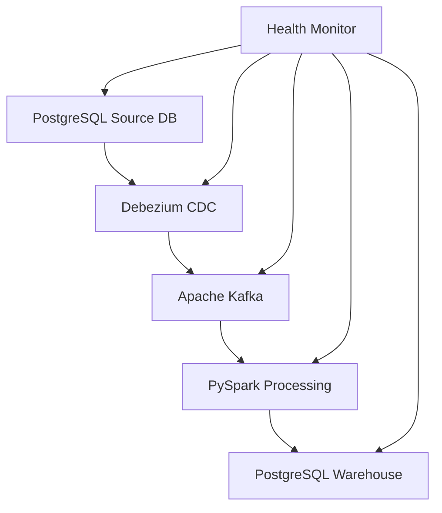

# Aladia Real-Time ETL Pipeline

A comprehensive real-time ETL (Extract, Transform, Load) pipeline built with Python, implementing Change Data Capture (CDC) using Apache Spark and modern data engineering practices.

## 🏗️ Architecture



## 🎯 Features

- **Real-time CDC** with Debezium PostgreSQL connector
- **Stream Processing** using PySpark for data transformations
- **Message Queue** with Apache Kafka for reliable event delivery
- **Docker Compose** setup for easy local development
- **Health Monitoring** with FastAPI dashboard
- **Comprehensive Testing** with unit and integration tests
- **Demo Scripts** for end-to-end pipeline demonstration

## 🚀 Quick Start

### Prerequisites

- Docker & Docker Compose
- Python 3.9+
- Git

### Setup

1. **Clone and setup environment:**
```bash
git clone <repository>
cd aladia-realtime-etl
cp .env.template .env
```

2. **Start infrastructure services:**
```bash
docker-compose up -d
```

3. **Install Python dependencies:**
```bash
pip install -r requirements.txt
pip install -e .
```

4. **Run the demo:**
```bash
python demo.py run
```

### Verify Setup

```bash
# Check all components health
python demo.py health

# Access health dashboard
curl http://localhost:8000/health

# View Kafka topics
docker exec kafka kafka-topics --list --bootstrap-server localhost:9092
```

## 📦 Components

### Source Database (`src/source_db/`)
- PostgreSQL with sample `orders` table
- CDC-enabled with logical replication
- Simulates real-time order updates

### CDC Component (`src/cdc/`)
- Debezium PostgreSQL connector
- Captures INSERT/UPDATE/DELETE events
- Publishes to Kafka topics

### Message Queue (`src/message_queue/`)
- Kafka producer/consumer implementations
- Standardized message formatting
- Retry logic and error handling

### Data Processing (`src/processing/`)
- PySpark streaming applications
- Real-time data transformations
- Schema validation and cleansing

### Data Warehouse (`src/warehouse/`)
- Analytics-optimized PostgreSQL schema
- Batch loading strategies
- Daily summary aggregations

### Orchestration (`src/orchestration/`)
- Health monitoring for all components
- FastAPI dashboard at `:8000`
- Centralized logging and metrics

## 🔧 Development

### Running Tests

```bash
# Unit tests
pytest tests/unit/

# Integration tests
pytest tests/integration/

# With coverage
pytest --cov=src tests/
```

### Code Quality

```bash
# Format code
black src/ tests/

# Lint code
flake8 src/ tests/

# Type checking
mypy src/
```

### Local Development

```bash
# Start individual components
python -m src.source_db.cli init
python -m src.cdc.cli setup
python -m src.orchestration.health_check serve

# Generate test data
python demo.py generate-data --orders 100

# Monitor pipeline
docker-compose logs -f kafka-connect
```

## 📊 Monitoring

- **Health Dashboard**: http://localhost:8000/health
- **Spark UI**: http://localhost:8080
- **Kafka Connect**: http://localhost:8083/connectors

## 🏛️ Architecture Decisions

### CDC Approach
**Choice**: Debezium with PostgreSQL logical replication  
**Rationale**: 
- Low latency (~milliseconds) change capture
- Guaranteed delivery with Kafka's durability
- Schema evolution support
- Battle-tested in production environments

**Trade-offs**:
- Requires WAL configuration on source database
- Additional operational complexity vs polling
- Memory overhead for replication slots

### Message Queue
**Choice**: Apache Kafka  
**Rationale**:
- High throughput and horizontal scalability
- Persistent, ordered message delivery
- Rich ecosystem and tooling
- Built-in partitioning for parallel processing

**Delivery Semantics**:
- At-least-once delivery with manual offset commits
- Idempotent consumers handle potential duplicates
- Dead letter queues for poison messages

### Data Processing
**Choice**: PySpark  
**Rationale**:
- Native streaming support with structured APIs
- Horizontal scaling across cluster nodes
- Rich transformation and aggregation functions
- Fault tolerance with automatic recovery

**Scaling Considerations**:
- Processes 10x volume by adding worker nodes
- Bottlenecks: Kafka partitions, network I/O, warehouse writes
- Backpressure handling with adaptive query execution

## 🚨 Production Considerations

### Scaling to 10x Volume

1. **Infrastructure**:
   - Kafka: Increase partitions and broker count
   - Spark: Add worker nodes with more cores/memory
   - Database: Read replicas and connection pooling

2. **Application**:
   - Implement micro-batching for warehouse writes
   - Add data compression and serialization optimizations
   - Implement circuit breakers and bulkheads

3. **Monitoring**:
   - Add metrics for throughput, latency, error rates
   - Implement alerting for component failures
   - Track data lineage and quality metrics

### What Would Break First?
1. **Database connections** - Limited connection pool
2. **Kafka consumer lag** - Single partition bottleneck
3. **Memory usage** - Large message accumulation
4. **Network I/O** - Cross-service communication overhead

## 📝 API Documentation

### Health Check API

```http
GET /health
# Returns overall system health

GET /health/source_db
# Returns specific component health
```

### CLI Commands

```bash
# Source database
python -m src.source_db init
python -m src.source_db simulate --iterations 10

# CDC management
python -m src.cdc setup
python -m src.cdc status orders-postgres-connector

# Message queue
python -m src.message_queue test-produce cdc-events --count 5
```

## 🧪 Testing Strategy

- **Unit Tests**: Mock external dependencies, test business logic
- **Integration Tests**: Use testcontainers for real service interactions
- **E2E Tests**: Full pipeline from source to warehouse
- **Performance Tests**: Throughput and latency benchmarks

## 📚 Further Reading

- [Debezium Documentation](https://debezium.io/documentation/)
- [Apache Kafka Streams](https://kafka.apache.org/documentation/streams/)
- [PySpark Streaming Guide](https://spark.apache.org/docs/latest/streaming-programming-guide.html)
- [PostgreSQL Logical Replication](https://www.postgresql.org/docs/current/logical-replication.html)

## 🤝 Contributing

1. Fork the repository
2. Create feature branch (`git checkout -b feature/amazing-feature`)
3. Commit changes (`git commit -m 'Add amazing feature'`)
4. Push to branch (`git push origin feature/amazing-feature`)
5. Open Pull Request

## 📄 License

This project is licensed under the MIT License - see LICENSE file for details.